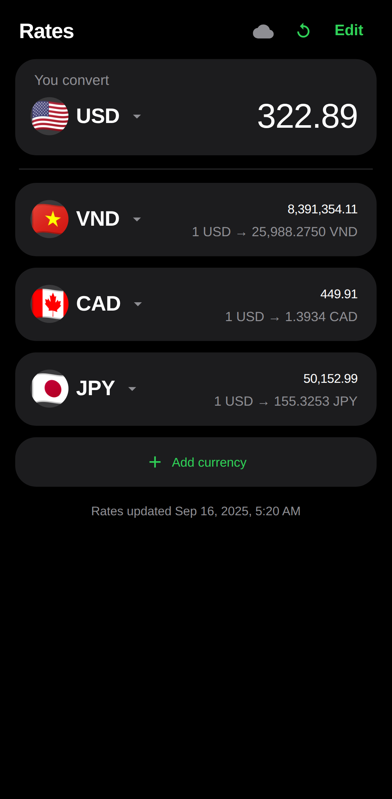
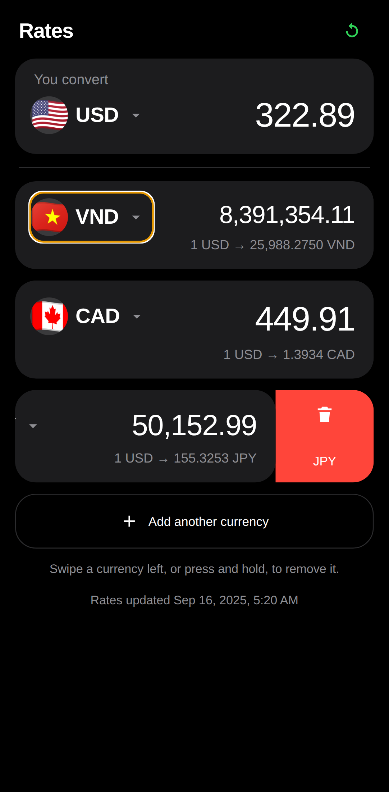
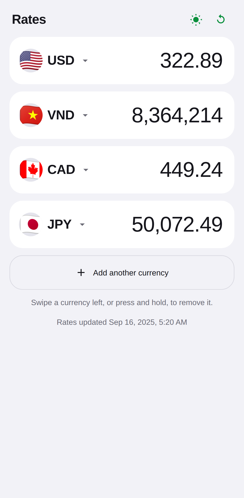
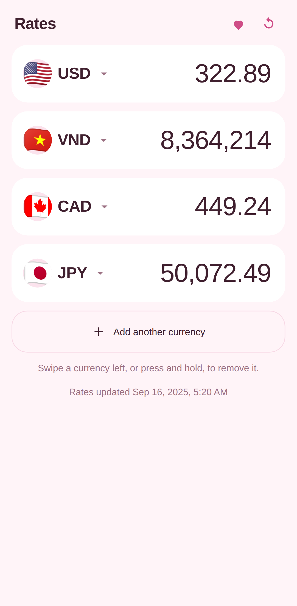
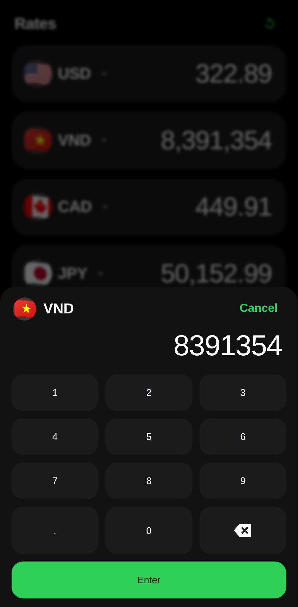

# Rates — Currency Exchange PWA

A one-screen currency converter. Type an amount once and see it in every currency
you care about. Works offline, installs to your phone's home screen, no build step,
no API key, no dependencies.



## What it does

- **Tap a currency** (the code or the flag) to swap it for another — 162 currencies, searchable.
- **Add another currency** appends a row, up to 12.
- **Swipe a row left** to reveal Delete, or **press and hold** it to confirm removal.
  With a keyboard, focus a currency and press Delete.
- **Every currency is an equal row.** There is no base and no special first card.
- **Tap any amount** to open a built-in numpad. Enter a figure in any row and every
  other row recalculates from it.
- Your list and the amount are saved on the device, so the app opens exactly where you left it.
- **Whole numbers where cents are noise**: VND never shows them, and neither does
  any amount of 100,000 or more.
- **Three themes.** The button beside refresh cycles dark → light → pastel pink,
  and the choice is remembered.
- **Offline**: the last rates are cached. The footer tells you the date they came from.
- **Installable**: Chrome/Edge show an Install button; on iOS use Share → Add to Home Screen.

## Rates

Fetched on load and when the app regains focus, at most once every 30 minutes.
Three free, key-less sources are tried in order, so one outage does not break the app:

1. `open.er-api.com`
2. `latest.currency-api.pages.dev`
3. `cdn.jsdelivr.net/npm/@fawazahmed0/currency-api`

Rates are mid-market reference rates. Banks and exchange desks charge a spread,
so treat these as indicative, not what you will actually get at the counter.






## Why a built-in numpad

Tapping a real text field makes a phone open its own keyboard and zoom the page
in, and iOS does not reliably zoom back out. Amounts are buttons instead, and
tapping one opens the app's own numpad: big keys, a backspace icon, and Enter.
Nothing ever takes focus, so the page never zooms.

## Run it locally

```bash
python3 -m http.server 8123
# open http://127.0.0.1:8123
```

Any static server works. Service workers need `http://localhost` or HTTPS —
opening `index.html` as a `file://` URL skips the offline layer.

## Deploy to Vercel

The repo is a Vercel-ready static site (`vercel.json` sets the service-worker and
manifest headers). Nothing to build, no environment variables, no backend.

1. Go to [vercel.com/new](https://vercel.com/new) and import this repository.
2. Framework preset: **Other**. Leave build command and output directory empty.
3. Deploy. You get `https://<project>.vercel.app`.

Every push to the connected branch redeploys automatically.

## Files

| File | Purpose |
| --- | --- |
| `index.html` | Markup for the converter and the currency picker sheet |
| `styles.css` | Dark theme, rounded cards, bottom sheet |
| `app.js` | State, rate fetching and caching, conversion, picker, PWA hooks |
| `currencies.js` | 162 currencies with names and flag emoji |
| `sw.js` | Service worker — caches the app shell, never caches rates |
| `manifest.webmanifest` | PWA metadata and icons |
| `vercel.json` | Static hosting headers |

Everything is stored on the device with `localStorage` — there is no account, no server
and no database. Clearing your browser data clears your currency list.

Flags are emoji, so there are no third-party image requests. On platforms without
flag emoji (most Windows browsers) the app falls back to the country code in the circle.
