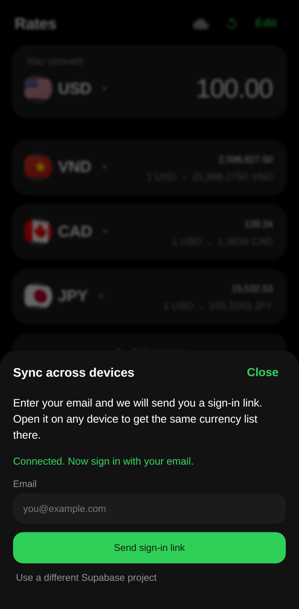

# Rates — Currency Exchange PWA

A one-screen currency converter. Type an amount once and see it in every currency
you care about. Works offline, installs to your phone's home screen, no build step,
no API key, no dependencies.


## What it does

- **Tap a currency** (the code or the flag) to swap it for another — 162 currencies, searchable.
- **Add currency** appends a row, up to 12.
- **Edit** shows a red minus on each row to take it off the list.
- **Type in any row**, not just the top one — every other amount recalculates.
- Your base currency, amount and list are saved in the browser, so the app opens where you left it.
- **Sync** (optional): sign in with your email and the same list follows you to every device.
- **Offline**: the last rates are cached. The footer tells you the date they came from.
- **Installable**: Chrome/Edge show an Install button; on iOS use Share → Add to Home Screen.

## Rates

Fetched on load and when the app regains focus, at most once every 30 minutes.
Three free, key-less sources are tried in order, so one outage does not break the app:

1. `open.er-api.com`
2. `latest.currency-api.pages.dev`
3. `cdn.jsdelivr.net/npm/@fawazahmed0/currency-api`

Rates are mid-market reference rates. Banks and exchange desks charge a spread,
so treat these as indicative, not what you will actually get at the counter.

## Memory across devices (Supabase)

Without any setup the app already remembers your choices in the browser it runs in.
Connect Supabase and it remembers them on your **account** instead, so your phone and
laptop show the same list.



**How it works**

- One row per person in `public.cx_prefs` — base currency, amount, currency list, `updated_at`.
- Sign-in is a magic link by email. No password to manage.
- Row Level Security means a signed-in person can only read and write their own row.
- Newest edit wins: on load the app compares timestamps and keeps whichever is newer,
  then writes changes back 1.2 seconds after you stop fiddling.
- Offline or signed out, everything still works from the local copy.

**Setup (one time)**

1. **Table** — paste `sql/001_cx_prefs.sql` into the Supabase SQL editor and run it.
   The `cx_` prefix keeps this app's table separate from others in the same project.
2. **Auth** — in Supabase → Authentication → URL Configuration, set the Site URL to your
   deployed URL and add `https://<project>.vercel.app/*` as a redirect URL. Email sign-in
   is on by default.
3. **Keys** — in Vercel → Settings → Environment Variables add:
   - `SUPABASE_URL` — your project URL
   - `SUPABASE_ANON_KEY` — the anon / publishable key
   Redeploy afterwards.
4. Open the app, tap the cloud icon, enter your email, open the link it sends you.

No key is committed to this repo. `api/config.js` reads the two environment variables at
request time and hands the browser only the anon key, which is meant to be public — RLS is
what protects the data. **Never put the service role key here**; it bypasses RLS.

For local testing without Vercel, tap the cloud icon and paste the URL and anon key
directly. They stay in that browser only.

## Run it locally

```bash
python3 -m http.server 8123
# open http://127.0.0.1:8123
```

Any static server works. Service workers need `http://localhost` or HTTPS —
opening `index.html` as a `file://` URL skips the offline layer.

## Deploy to Vercel

The repo is already a Vercel-ready static site (`vercel.json` sets the service-worker
and manifest headers). Nothing to build.

1. Go to [vercel.com/new](https://vercel.com/new) and import this repository.
2. Framework preset: **Other**. Leave build command and output directory empty.
3. Deploy. You get `https://<project>.vercel.app`.
4. Optional: add the two Supabase environment variables above to turn on sync.

Every push to the connected branch redeploys automatically.

## Files

| File | Purpose |
| --- | --- |
| `index.html` | Markup for the converter and the currency picker sheet |
| `styles.css` | Dark theme, rounded cards, bottom sheet |
| `app.js` | State, rate fetching and caching, conversion, picker, PWA hooks |
| `currencies.js` | 162 currencies with names and flag emoji |
| `supabase.js` | Sync client — magic-link auth and the preferences row, plain `fetch` |
| `api/config.js` | Vercel function serving the Supabase URL and anon key from env vars |
| `sql/001_cx_prefs.sql` | Table and Row Level Security policies |
| `sw.js` | Service worker — caches the app shell, never caches rates |
| `manifest.webmanifest` | PWA metadata and icons |
| `vercel.json` | Static hosting headers |

Flags are emoji, so there are no third-party image requests. On platforms without
flag emoji (most Windows browsers) the app falls back to the country code in the circle.
